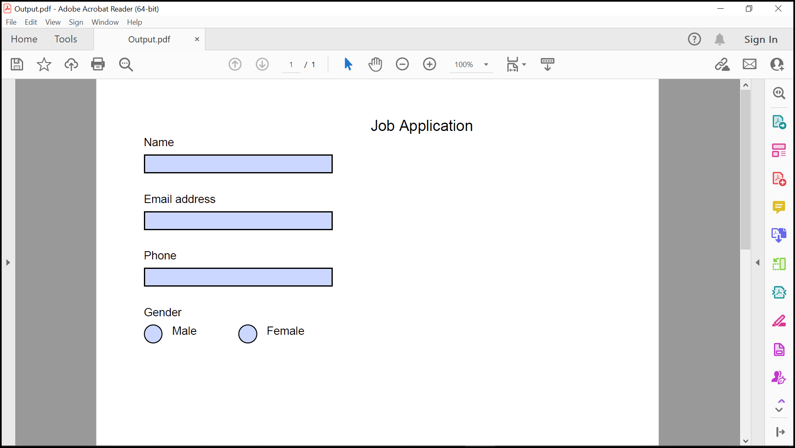

# How to Create, Fill, and Flatten PDF Form Fields in .NET using the Syncfusion PDF Library

## Introduction
A quick start .NET console project that shows how to create, fill, and flatten PDF form fields using the Syncfusion PDF Library.

## System requirement
**Framework and SDKs**
* .NET SDK (version 5.0 or later)

**IDEs**
*  Visual Studio 2019/ Visual Studio 2022

## Code snippet for Create, Fill, and Flatten PDF Form Fields
We will create a new .NET console application, add the Syncfusion PDF library package, and write the code

```csharp
static void CreateForm() 
{
    PdfDocument document = new PdfDocument();
    PdfPage page = document.Pages.Add();
    PdfFont font = new PdfStandardFont(PdfFontFamily.Helvetica, 16);
    page.Graphics.DrawString("Job Application", font, PdfBrushes.Black, new PointF(250, 0));

    font = new PdfStandardFont(PdfFontFamily.Helvetica, 12);
    page.Graphics.DrawString("Name", font, PdfBrushes.Black, new PointF(10, 20));
    PdfTextBoxField textBoxField1 = new PdfTextBoxField(page, "Name");
    textBoxField1.Bounds = new RectangleF(10, 40, 200, 20);
    textBoxField1.ToolTip = "Name";
    document.Form.Fields.Add(textBoxField1);

    page.Graphics.DrawString("Email address", font, PdfBrushes.Black, new PointF(10, 80));
    PdfTextBoxField textBoxField2 = new PdfTextBoxField(page, "Email address");
    textBoxField2.Bounds = new RectangleF(10, 100, 200, 20);
    textBoxField2.ToolTip = "Email address";
    document.Form.Fields.Add(textBoxField2);

    page.Graphics.DrawString("Phone", font, PdfBrushes.Black, new PointF(10, 140));
    PdfTextBoxField textBoxField3 = new PdfTextBoxField(page, "Phone");
    textBoxField3.Bounds = new RectangleF(10, 160, 200, 20);
    textBoxField3.ToolTip = "Phone";
    document.Form.Fields.Add(textBoxField3);

    page.Graphics.DrawString("Gender", font, PdfBrushes.Black, new PointF(10, 200));
    PdfRadioButtonListField employeesRadioList = new PdfRadioButtonListField(page, "Gender");
    document.Form.Fields.Add(employeesRadioList);
    page.Graphics.DrawString("Male", font, PdfBrushes.Black, new PointF(40, 220));
    PdfRadioButtonListItem radioButtonItem1 = new PdfRadioButtonListItem("Male");
    radioButtonItem1.Bounds = new RectangleF(10, 220, 20, 20);
    page.Graphics.DrawString("Female", font, PdfBrushes.Black, new PointF(140, 220));
    PdfRadioButtonListItem radioButtonItem2 = new PdfRadioButtonListItem("Female");
    radioButtonItem2.Bounds = new RectangleF(110, 220, 20, 20);
    employeesRadioList.Items.Add(radioButtonItem1);
    employeesRadioList.Items.Add(radioButtonItem2);


    using (FileStream outputFileStream = new FileStream("Output.pdf", FileMode.Create, FileAccess.ReadWrite)) 
    {        
        document.Save(outputFileStream);
    }
    document.Close(true);
}

static void FillForm() 
{
    FileStream docStream = new FileStream("Output.pdf", FileMode.Open, FileAccess.Read);
    PdfLoadedDocument loadedDocument = new PdfLoadedDocument(docStream);
    PdfLoadedForm form = loadedDocument.Form;
    PdfLoadedFormFieldCollection fieldCollection = form.Fields as PdfLoadedFormFieldCollection;
    PdfLoadedField loadedField = null;

    if (fieldCollection.TryGetField("Name", out loadedField)) {
        (loadedField as PdfLoadedTextBoxField).Text = "Simons";
    }
    if (fieldCollection.TryGetField("Email address", out loadedField)) {
        (loadedField as PdfLoadedTextBoxField).Text = "simonsbistro@outlook.com";
    }

    if (fieldCollection.TryGetField("Phone", out loadedField)) {
        (loadedField as PdfLoadedTextBoxField).Text = "31 12 34 56";
    }

    if (fieldCollection.TryGetField("Gender", out loadedField)) {
        (loadedField as PdfLoadedRadioButtonListField).SelectedIndex = 0;
    }
    form.Flatten = true;

    using (FileStream outputFileStream = new FileStream("FilledPDF.pdf", FileMode.Create, FileAccess.ReadWrite)) {
        loadedDocument.Save(outputFileStream);
    }
    loadedDocument.Close(true);
}
```

**Output Image**

**CreateFormPDF**


**FilledPDF**


## How to run the examples
* Download this project to a location in your disk. 
* Open the solution file using Visual Studio. 
* Rebuild the solution to install the required NuGet package. 
* Run the application.

## Resources
*   **Product page:** [Syncfusion PDF Framework](https://www.syncfusion.com/document-processing/pdf-framework/net)
*   **Documentation page:** [Syncfusion .NET PDF library](https://help.syncfusion.com/file-formats/pdf/overview)
*   **Online demo:** [Syncfusion .NET PDF library - Online demos](https://ej2.syncfusion.com/aspnetcore/PDF/CompressExistingPDF#/bootstrap5)
*   **Blog:** [Syncfusion .NET PDF library - Blog](https://www.syncfusion.com/blogs/category/pdf)
*   **Knowledge Base:** [Syncfusion .NET PDF library - Knowledge Base](https://www.syncfusion.com/kb/windowsforms/pdf)
*   **EBooks:** [Syncfusion .NET PDF library - EBooks](https://www.syncfusion.com/succinctly-free-ebooks)
*   **FAQ:** [Syncfusion .NET PDF library - FAQ](https://www.syncfusion.com/faq/)

## Support and feedback
*   For any other queries, reach our [Syncfusion support team](https://www.syncfusion.com/support/directtrac/incidents/newincident?utm_source=github&utm_medium=listing&utm_campaign=github-docio-examples) or post the queries through the [community forums](https://www.syncfusion.com/forums?utm_source=github&utm_medium=listing&utm_campaign=github-docio-examples).
*   Request new feature through [Syncfusion feedback portal](https://www.syncfusion.com/feedback?utm_source=github&utm_medium=listing&utm_campaign=github-docio-examples).

## License
This is a commercial product and requires a paid license for possession or use. Syncfusion’s licensed software, including this component, is subject to the terms and conditions of [Syncfusion's EULA](https://www.syncfusion.com/eula/es/?utm_source=github&utm_medium=listing&utm_campaign=github-docio-examples). You can purchase a licnense [here](https://www.syncfusion.com/sales/products?utm_source=github&utm_medium=listing&utm_campaign=github-docio-examples) or start a free 30-day trial [here](https://www.syncfusion.com/account/manage-trials/start-trials?utm_source=github&utm_medium=listing&utm_campaign=github-docio-examples).

## About Syncfusion
Founded in 2001 and headquartered in Research Triangle Park, N.C., Syncfusion has more than 26,000+ customers and more than 1 million users, including large financial institutions, Fortune 500 companies, and global IT consultancies.

Today, we provide 1600+ components and frameworks for web ([Blazor](https://www.syncfusion.com/blazor-components?utm_source=github&utm_medium=listing&utm_campaign=github-docio-examples), [ASP.NET Core](https://www.syncfusion.com/aspnet-core-ui-controls?utm_source=github&utm_medium=listing&utm_campaign=github-docio-examples), [ASP.NET MVC](https://www.syncfusion.com/aspnet-mvc-ui-controls?utm_source=github&utm_medium=listing&utm_campaign=github-docio-examples), [ASP.NET WebForms](https://www.syncfusion.com/jquery/aspnet-webforms-ui-controls?utm_source=github&utm_medium=listing&utm_campaign=github-docio-examples), [JavaScript](https://www.syncfusion.com/javascript-ui-controls?utm_source=github&utm_medium=listing&utm_campaign=github-docio-examples), [Angular](https://www.syncfusion.com/angular-ui-components?utm_source=github&utm_medium=listing&utm_campaign=github-docio-examples), [React](https://www.syncfusion.com/react-ui-components?utm_source=github&utm_medium=listing&utm_campaign=github-docio-examples), [Vue](https://www.syncfusion.com/vue-ui-components?utm_source=github&utm_medium=listing&utm_campaign=github-docio-examples), and [Flutter](https://www.syncfusion.com/flutter-widgets?utm_source=github&utm_medium=listing&utm_campaign=github-docio-examples)), mobile ([Xamarin](https://www.syncfusion.com/xamarin-ui-controls?utm_source=github&utm_medium=listing&utm_campaign=github-docio-examples), [Flutter](https://www.syncfusion.com/flutter-widgets?utm_source=github&utm_medium=listing&utm_campaign=github-docio-examples), [UWP](https://www.syncfusion.com/uwp-ui-controls?utm_source=github&utm_medium=listing&utm_campaign=github-docio-examples), and [JavaScript](https://www.syncfusion.com/javascript-ui-controls?utm_source=github&utm_medium=listing&utm_campaign=github-docio-examples)), and desktop development ([WinForms](https://www.syncfusion.com/winforms-ui-controls?utm_source=github&utm_medium=listing&utm_campaign=github-docio-examples), [WPF](https://www.syncfusion.com/wpf-ui-controls?utm_source=github&utm_medium=listing&utm_campaign=github-docio-examples), [WinUI(Preview)](https://www.syncfusion.com/winui-controls?utm_source=github&utm_medium=listing&utm_campaign=github-docio-examples), [Flutter](https://www.syncfusion.com/flutter-widgets?utm_source=github&utm_medium=listing&utm_campaign=github-docio-examples) and [UWP](https://www.syncfusion.com/uwp-ui-controls?utm_source=github&utm_medium=listing&utm_campaign=github-docio-examples)). We provide ready-to-deploy enterprise software for dashboards, reports, data integration, and big data processing. Many customers have saved millions in licensing fees by deploying our software.